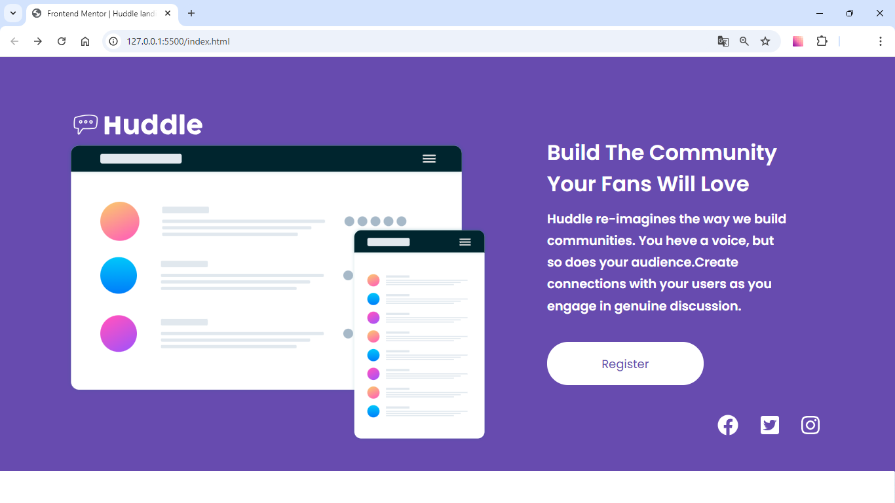

# Projeto HUDDLE - FRONTEND MENTOR
Esse projeto foi proposto pelo DEVEMDOBRO para aplicar conhecimentos aprendidos em aula usando flex box.

[]

## Tecnologia usada
- HTML
- CSS
- RESPONSIVIDADE para desktop e mobile

## Sobre o projeto

Esse projeto foi um desafio muito gratificante, pois quebrei muito a cabeça pra resolver pequenos erros que passaram despercebidos fazendo com que minhas habilidades fossem melhoradas.

